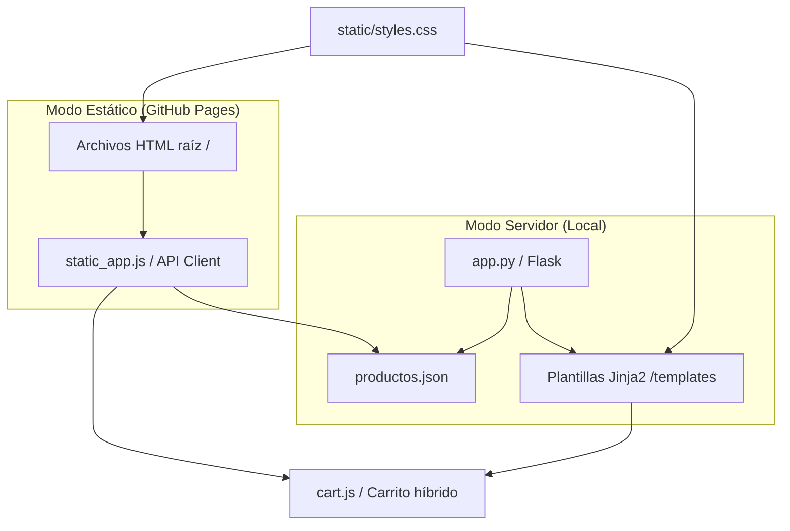

# 🧬 BioTinker E-Commerce - Algoritmos y Estructura de Datos

BioTinker es una plataforma de e-commerce especializada en insumos biotecnológicos (cepas microbiológicas, reactivos y enzimas) diseñada bajo el marco de la materia **Algoritmos y Estructuras de Datos**. 

La aplicación cuenta con una **arquitectura dual** que permite dos modos de ejecución: un servidor local dinámico implementado en **Python Flask** y una versión interactiva estática optimizada para su publicación en **GitHub Pages**.

---

## 🚀 1. Cómo Desplegar y Acceder al Proyecto en GitHub Pages (URL Pública)

Para publicar el proyecto en la web de forma 100% gratuita y sin necesidad de configurar servidores de backend:

1.  **Subir a GitHub:** Asegúrate de empujar la carpeta del proyecto a tu repositorio público de GitHub (`git push origin main`).
2.  **Configurar Pages:**
    *   Entra a tu repositorio en la web de GitHub.
    *   Ve a la pestaña **Settings** (Configuración) en el menú superior.
    *   En la barra lateral izquierda, selecciona la opción **Pages** (dentro del bloque *Code and automation*).
3.  **Habilitar Rama:**
    *   En la sección *Build and deployment > Source*, selecciona **Deploy from a branch**.
    *   En *Branch*, elige tu rama principal (normalmente **`main`** o `master`).
    *   En la carpeta desplegable contigua, selecciona **`/(root)`** (la carpeta raíz del proyecto).
    *   Haz clic en **Save** (Guardar).
4.  **Acceder a la URL Pública:**
    *   GitHub comenzará a compilar el sitio. En un par de minutos, refresca la página de Settings > Pages y verás un banner en la parte superior con tu URL pública:
        `https://lsegecode.github.io/algoritmos-ecommerce/index.html`
    *   *Nota: Recuerda ingresar con `/index.html` al final para abrir la interfaz del catálogo directamente.*

---

## 🏗️ 2. Arquitectura del Proyecto (Soporte Dual)

El proyecto está estructurado bajo un modelo de **Soporte Híbrido**:

1.  **Modo Servidor Dinámico (Local):** Ejecutado en local con `python app.py`. Utiliza Flask para procesar las rutas y renderizar las vistas mediante Jinja2. Las búsquedas, filtros y compras se validan en la memoria del servidor de Python.
2.  **Modo Estático (Producción/GitHub Pages):** Ejecutado al abrir `index.html` directamente o vía GitHub Pages. Utiliza JavaScript (`static_app.js`) para emular el servidor: descarga el archivo `productos.json`, procesa búsquedas, filtros y ordenamiento en el cliente, y guarda los cambios en el `sessionStorage` del navegador para simular compras.

---

## 📁 3. Estructura y Función de los Archivos del Proyecto

A continuación se detalla la función de cada uno de los archivos que componen este repositorio:

### 📄 Archivos de Documentación y Guías
*   **`README.md`**: El presente archivo. Guía de despliegue, arquitectura e inventario de archivos.
*   **`Prompts.md`**: Bitácora requerida por la cátedra que documenta de forma cronológica los prompts utilizados para interactuar con la IA durante el desarrollo.
*   **`propuesta.md`**: Documento con la fundamentación inicial de BioTinker, el análisis de requerimientos mínimos y la justificación teórica de la estructura del registro.
*   **`plan_implementacion.md`**: Plan técnico inicial aprobado para la construcción del backend Flask y la estructura del carrito.
*   **`plan_implementacion_despliegue.md`**: Plan técnico de extensión aprobado para realizar el desacoplamiento estático y habilitar la publicación en GitHub Pages.

### 💾 Base de Datos y Lógica del Servidor (Flask)
*   **`productos.json`**: Base de datos simulada del laboratorio. Almacena en formato JSON el registro de las 10 cepas con campos como SKU (`id_cepa_sku`), precios (regular y mayorista), stock y descripción.
*   **`app.py`**: Servidor de backend en Flask. Define las rutas principales (`/`, `/producto/<sku>` y `/prompts`), carga los datos del catálogo a la memoria del servidor y provee un miniparser de Markdown a HTML escrito en Python para renderizar los archivos de documentación dinámicamente.

### 🎨 Plantillas de Flask (Jinja2)
*   `templates/base.html`: Esqueleto HTML común que define el navbar, el panel deslizable del carrito, el contenedor de toasts y el pie de página.
*   `templates/index.html`: Vista de catálogo dinámico. Implementa la grilla de productos y el formulario de búsquedas que envía parámetros por GET a Flask.
*   `templates/detalle.html`: Vista detallada del registro de un producto específico obtenido en tiempo constante $O(1)$ usando su SKU.
*   `templates/prompts.html`: Consola interactiva de slideshow y desplegables de documentación generada de forma dinámica por el servidor.

### 🌐 Vistas Estáticas (GitHub Pages)
*   **`index.html`** (en la raíz): Catálogo estático equivalente a la plantilla de Flask, pero que delega la renderización a JavaScript.
*   **`detalle.html`** (en la raíz): Ficha técnica estática del producto que lee el SKU desde la URL y muestra la calculadora interactiva.
*   **`prompts.html`** (en la raíz): Consola estática de slideshow que realiza peticiones fetch de los archivos markdown y los parsea en el navegador.

### ⚡ Recursos Estáticos (CSS y JavaScript)
*   `static/css/styles.css`: Estilos visuales compartidos de la aplicación. Diseña una interfaz premium de laboratorio de biotecnología (*Dark Lab Mode*) con efectos de glassmorphism y transiciones fluidas.
*   `static/js/cart.js`: Administrador del carrito en memoria de JavaScript. Es híbrido: si detecta que la web corre estática procesa el stock en el cliente; si detecta Flask, llama mediante fetch POST a la API del servidor.
*   `static/js/static_app.js`: Cerebro de la versión de GitHub Pages. Ejecuta búsquedas, ordenación y filtrados, almacena los stocks en `sessionStorage` y contiene el parser de Markdown a HTML escrito en JavaScript.

---

## 🚫 4. Archivos Deprecados e Historial de Desarrollo

Durante el proceso de prototipado y refinamiento, se utilizaron archivos de desarrollo preliminares que ahora se consideran **deprecados** y no forman parte del entregable final en producción:

*   **`apps.py` (Deprecado):** Versión inicial de prueba del servidor Flask. Fue descartado y renombrado a `app.py` para cumplir con las convenciones nativas del framework Flask, el cual por defecto busca el archivo `app.py` para levantar el servidor web local (`flask run`) sin requerir configuraciones de variables de entorno adicionales.
*   **`app_v2` / `app_v2.py` (Deprecado):** Prototipo de desarrollo intermedio creado para ensayar la lógica de descuento de stocks de compra mayorista y el parseador de archivos markdown. Sus funcionalidades y mejoras de seguridad se integraron en el archivo de producción definitivo `app.py` y en el cliente interactivo `static_app.js`.
*   **`propuesta_registro.json` (Deprecado):** Archivo JSON original provisto por el usuario en la fase previa al diseño. Ha sido reemplazado por `productos.json`, el cual expande el esquema incorporando las nuevas columnas obligatorias solicitadas (`Descripcion`, `precio_mayorista` y `Categoria`) y actualiza la clave primaria a `id_cepa_sku`.