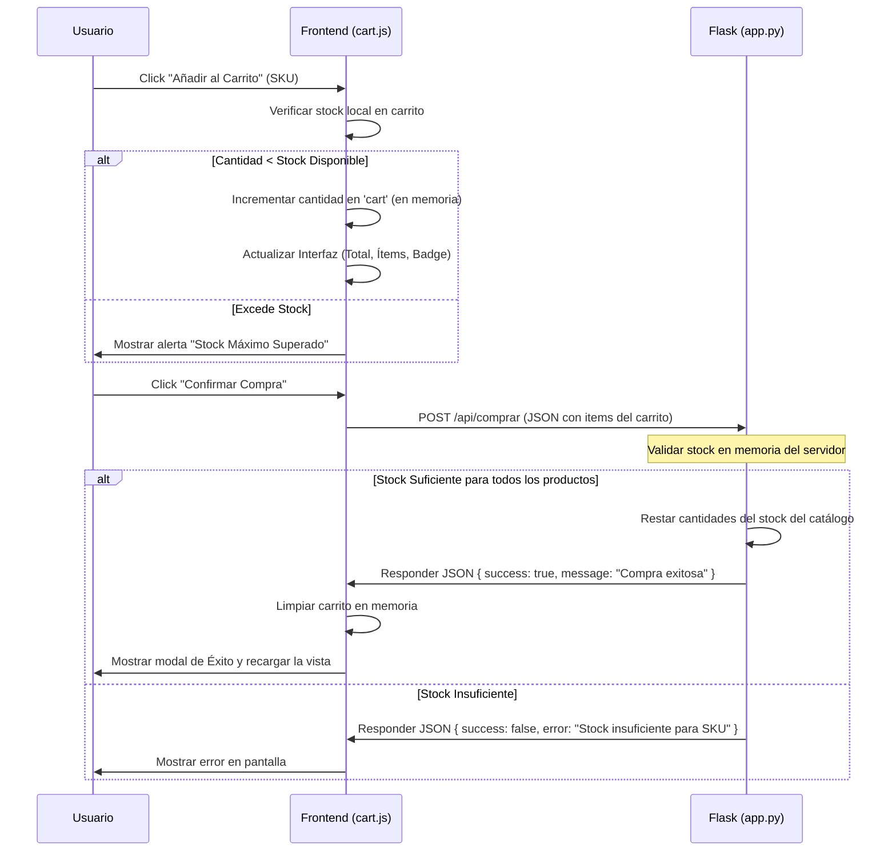

# Plan de Implementación: BioTinker E-Commerce

Propuesta para el desarrollo inicial del e-commerce de biotecnología **BioTinker**, adaptado para la materia *Algoritmos y Estructuras de Datos*. El diseño utilizará almacenamiento de datos estructurado en formato JSON y una arquitectura simple basada en funciones, con un carrito en memoria del lado del cliente.

## Requerimientos y Diseño

### Estructura del Carrito en Memoria Caché
Para cumplir con la restricción de que al recargar la página se pierdan los productos agregados, utilizaremos un **estado en memoria de JavaScript (JS variable)**. Esto significa que el carrito residirá puramente en el hilo de ejecución del frontend y no se persistirá en `localStorage` o `sessionStorage`. 

### Persistencia de Stock en el Servidor
El stock disponible se cargará en la memoria del servidor Flask al iniciar (a partir del archivo JSON). Cuando se simule la compra, el stock se descontará en la memoria del servidor. Al reiniciar la aplicación de Flask, el stock volverá a su estado inicial.

### Diseño de Interfaz Premium
Diseñaremos una interfaz moderna y atractiva utilizando una paleta de colores científica y bio-tecnológica (tonos oscuros profundos con acentos en cian y verde fluorescente/azul bioluminiscente), con efectos de vidrio (glassmorphism) y transiciones fluidas.

---

## Estructura del Registro Principal: `Producto`

Los productos se modelarán en un archivo JSON (`productos.json`) bajo el siguiente esquema, modificando y expandiendo el formato provisto por el usuario:

- `id_cepa_sku` *(Clave Primaria)*: Código identificador (reemplaza `id_cepa_cas`).
- `nombre_cientifico`: Nombre científico de la cepa o reactivo.
- `nivel_bioseguridad`: Nivel de bioseguridad (1, 2, etc.).
- `temp_almacenamiento`: Temperatura de almacenamiento recomendada (°C).
- `requiere_licencia`: Booleano indicando si requiere licencia para su manipulación.
- `precio_por_microlitro`: Costo por microlitro.
- `precio_mayorista`: Costo mayorista (agregado justo después de precio por microlitro).
- `volumen_stock`: Volumen total disponible en stock (microlitros).
- `Descripcion`: Detalles técnicos y descripción científica del producto.
- `Categoria`: Categoría científica (ej. *Bioluminiscencia*, *Ingeniería Genética*, *Microbiología Industrial*).

---

## Arquitectura de la Aplicación (Flask)

### Funciones Principales (`app.py`):
- `cargar_productos()`: Lee y retorna el diccionario de productos desde `productos.json`.
- `buscar_productos(criterio)`: Busca productos por coincidencia en el SKU o nombre científico.
- `filtrar_por_categoria(categoria)`: Filtra productos por su categoría.
- `ordenar_productos(criterio, reverso)`: Ordena los productos según un campo (ej. precio o stock).
- `realizar_compra(carrito_items)`: Procesa la compra reduciendo el stock en memoria de los productos correspondientes.

### Rutas de Flask:
- `/` (GET): Muestra el catálogo principal de productos, permitiendo búsquedas, ordenamientos y filtrados.
- `/producto/<id_cepa_sku>` (GET): Vista detallada de un producto por su clave SKU.
- `/api/comprar` (POST): Endpoint API que recibe los ítems del carrito para simular la compra y validar stock.

---

## Flujo del Carrito de Compras

El procedimiento se estructurará de la siguiente manera:

